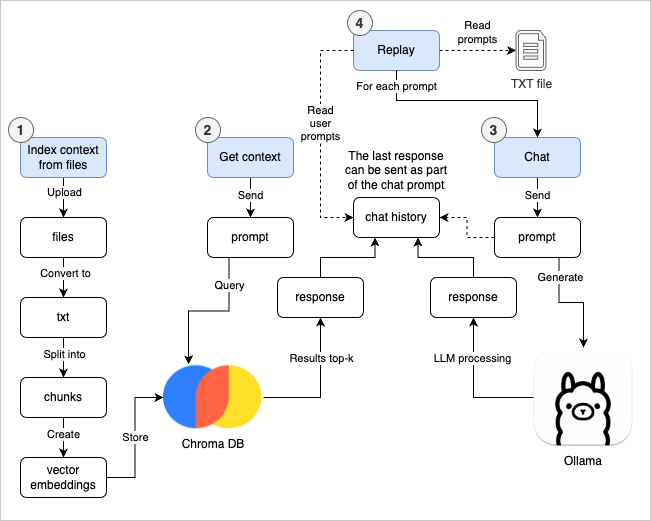

# LLM Workbench

A RAG-enabled workbench to index files and chat with an core.

## How it works



## Setup

Download and install [Ollama](https://www.ollama.com), a framework to interact with LLMs.

After installation, run Ollama:

```bash
ollama serve
```

In order to configure the model and the application, in a new terminal, run:

```bash
make setup
```

## Running the app

```bash
make
```

A chat page to load context files and interact with the LLM will open in your browser.

In the page, you can:

1. Upload and index context files.
    - You can use set chunk size and overlap during uploading.
2. Use a prompt to retrive context files by starting it with `/context`.
    - You can use a number after `/context` to set the maximum number of context entries to return, e.g. `/context:2` will return at most 2 context entries.
3. Use a prompt so the LLM so it can generate a response. The last response (which can e.g. be a context response) can be sent by adding the key `{response:last}` into the prompt.
4. Any prompt can have labels so their response can be referenced with multiple `{response:label:<label>}`.
    - Add labels by starting a prompt with `:<label>`.
    - Labels should contain only lowercase alphanumeric characters and hyphens. Example: `:label1` and`:my-label` are a valid labels, but `:Label1` and`:My_Label` are not.
5. Replay a set of user prompts, either from the current chat history or a text file.

All prompts and responses are displayed in the chat container in the page.

## Known issues

1. The buttons in the screen are not always disabled during operations. Please be aware that clicking on different buttons during actions may lead to unintended consequences.
2. Complex Excel/.xlsx files may not be loadable due to format incompatibility with `openpyxl`.
3. During replay, the scrolling may not be automatic.
