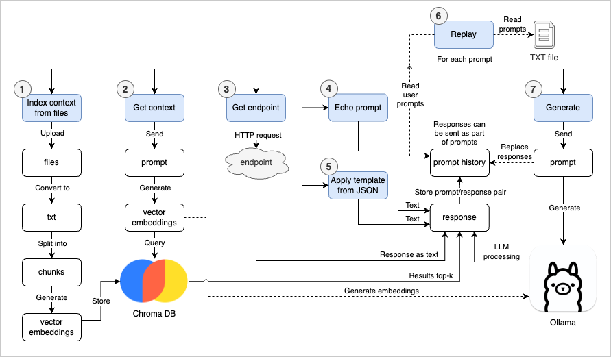

# LLM Workbench

A RAG-enabled workbench to index files and chat with an LLM.

## How it works



## Setup

Download and install [Ollama](https://www.ollama.com), a framework to interact with LLMs.

After installation, run Ollama:

```bash
ollama serve
```

In order to configure the model and the application, in a new terminal, run:

```bash
make setup
```

## Running the app

```bash
make
```

A chat page to load context files and interact with the LLM will open in your browser.

In the page, you can:

1. Upload context files.
2. Use a prompt to retrive context files by starting it with `/context`.
3. Use a prompt to the LLM so it can generate a response. The previous answer (which can e.g. be a context response) can be sent by adding the key `{previous_response}` into the prompt.
4. Replay a set of user prompts, either from the current chat history or a text file.

All prompts and responses are displayed in the chat container in the page.
